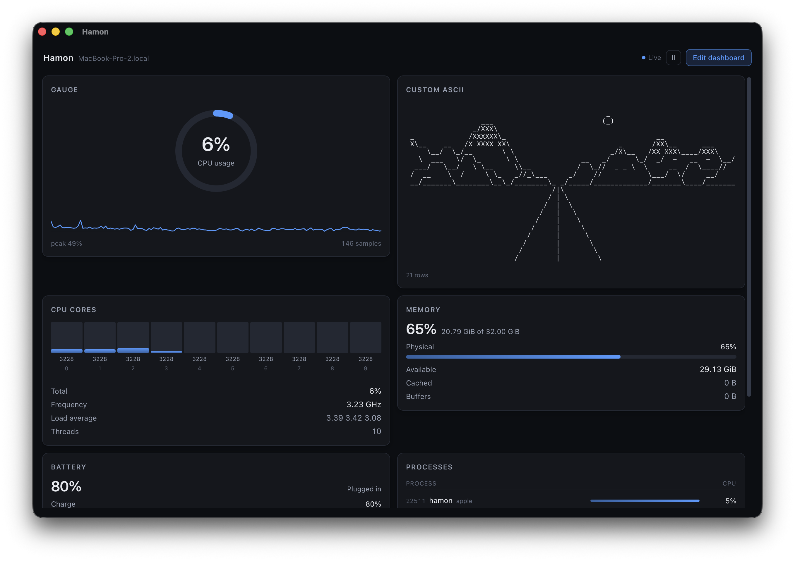

# Hamon

A lightweight hardware monitor with a dashboard of widgets you arrange yourself.
Built with Tauri 2 (Rust backend, Svelte frontend).



## Features

- 17 widgets: CPU cores, memory, GPU, network, disks, temperatures, processes, battery, and more
- Add, remove, reorder and configure widgets from inside the app
- Small footprint: the macOS DMG is about 5.4 MB
- Missing data shows as `—`, never as `0`, so "no data" is never mistaken for "idle"

## Status

| Platform | Status |
| --- | --- |
| macOS (Apple Silicon) | Working, main development target |
| Linux | Compiles cleanly, not yet tested on real hardware |
| Windows | Not supported |

## Quick start

**Requirements:** Rust 1.90+, Node 20+, and [Tauri's platform prerequisites](https://v2.tauri.app/start/prerequisites/).

```sh
npm install
npm run tauri dev      # run the app
npm run tauri build    # build Hamon.app and a .dmg
```

Bundles are written to `src-tauri/target/release/bundle/`.
The first Rust build is slow. Later builds are fast.

### macOS notes

- **Unsigned build.** On first launch, right-click the app and choose Open, or run:
  ```sh
  xattr -d com.apple.quarantine Hamon.app
  ```
- **Temperatures need root.** macOS only exposes them through the SMC. Hamon runs
  without root and lists which sensors it couldn't read. To read them all:
  ```sh
  sudo ./src-tauri/target/release/hamon
  ```

### Linux notes

Install WebKitGTK and its dependencies first.

**NixOS** (`shell.nix`):
```nix
{ pkgs ? import <nixpkgs> { } }:
pkgs.mkShell {
  packages = with pkgs; [
    cargo rustc nodejs_22 pkg-config
    webkitgtk_4_1 gtk3 libsoup_3 javascriptcoregtk-4.1 librsvg
  ];
}
```

**Debian/Ubuntu:**
```sh
sudo apt install libwebkit2gtk-4.1-dev libgtk-3-dev libsoup-3.0-dev \
  libjavascriptcoregtk-4.1-dev librsvg2-dev build-essential curl file \
  libssl-dev pkg-config
```

Then run `npm install && npm run tauri dev`.

Where each reading comes from, and what to expect:

| Data | Source | Note |
| --- | --- | --- |
| Temperatures, fans | `/sys/class/hwmon` | Some chips (`coretemp`, `k10temp`) need root. They show a lock icon. |
| GPU | NVIDIA NVML, loaded at runtime | Without `libnvidia-ml.so.1`, the GPU widget shows what else is available. |
| Disks | `/proc/diskstats` | Whole disks and partitions both appear. |
| Network | `/proc/net/dev`, `/sys/class/net`, `getifaddrs` | |
| Distro name | `/etc/os-release` | |

One test, `finds_loopbacks_ipv4_address`, expects a `lo` interface and can't pass on macOS.

## Development

```sh
npm run dev            # frontend only, in a browser, with fake data
npm run tauri dev      # full app
```

`npm run dev` works without Rust because `src/lib/mock.ts` stands in for the backend.

### Checks

```sh
npm run check                    # types + both contract checks below
cd src-tauri && cargo test
cd src-tauri && cargo clippy --all-targets
cd src-tauri && cargo fmt --check
```

Some definitions exist in both Rust and TypeScript, so two scripts keep them in sync:

- `check:catalog` compares the widget list in `catalog.ts` with `layout.rs`.
- `check:wire` compares the data shape in `mock.ts` with the real Rust output.

## How it works

A sampler thread reads the hardware once per tick and pushes a full snapshot to the UI. The UI never polls.

```
src-tauri/src/
  collect/    what each number is (CPU, memory, disk, ...), written once
  platform/   where each OS keeps it (macOS FFI, Linux /proc and /sys)
  sample.rs   sampler thread
  commands.rs UI-to-backend commands
  model.rs    data types sent to the UI
  layout.rs   saved layout and widget catalog
src/
  lib/tauri.ts   the only file that talks to Tauri (real or mock)
  lib/widgets/   one component per widget
  App.svelte     main window
```

Design choices:

- **The backend owns the layout.** Every change returns the saved layout, so the UI can't drift out of sync.
- **Charts grow in fixed steps.** An idle CPU graph doesn't look like a storm.
- **Gaps stay gaps.** Missing data breaks the line instead of being drawn across.

## Your layout

Saved as `layout.json`:

- macOS: `~/Library/Application Support/com.hamon.app/layout.json`
- Linux: `~/.config/com.hamon.app/layout.json`

To reset, use **Edit dashboard → Reset**, or delete the file.
